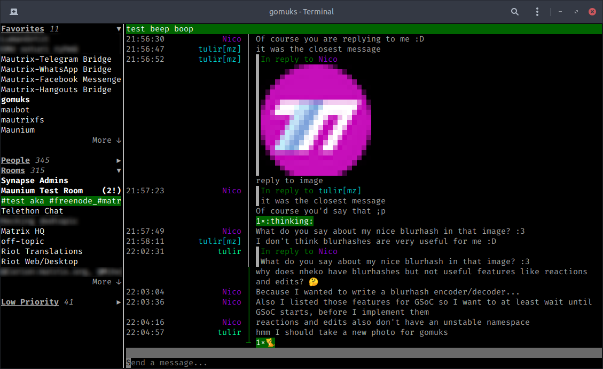

# gomuks

[](LICENSE)<!--
[](https://github.com/tulir/gomuks/releases)-->
[](https://mau.dev/tulir/gomuks/pipelines)
[](https://codeclimate.com/github/tulir/gomuks)



A terminal Matrix client written in Go using [mautrix](https://github.com/tulir/mautrix-go) and [mauview](https://github.com/tulir/mauview).

Basic usage is possible, but expect bugs and missing features.

## Discussion
Matrix room: [#gomuks:maunium.net](https://matrix.to/#/#gomuks:maunium.net)

## Installation
Once the client becomes actually usable, I'll start making GitHub releases with
precompiled executables. For now, you can either download a CI build from
[GitLab CI](https://mau.dev/tulir/gomuks/pipelines) or compile from source:

0. Install [Go](https://golang.org/) 1.12 or higher
1. Clone the repo: `git clone https://github.com/tulir/gomuks.git && cd gomuks`
2. Build: `go build`

Simply pull changes (`git pull`) and run `go build` again to update.

## Debugging
If something doesn't work but it doesn't crash, check the `/tmp/gomuks/debug.log` file for any errors.

## Developing
Set `DEBUG=1` to enable partial deadlock detection and to write panics to stdout instead of a file.

To build and run with [race detection](https://golang.org/doc/articles/race_detector.html),
use `go install -race` and set `GORACE='history_size=7 log_path=/tmp/gomuks/race.log'`
when starting gomuks, then check `/tmp/gomuks/race.log.<pid>`. Note that race detection
will use a lot of extra resources.

Proper debuggers are too fancy, but normal prints won't work in a TUI application. To write to the
debug log mentioned previously, use the `maunium.net/go/gomuks/debug` package:

```go
package foo

import (
	"maunium.net/go/gomuks/debug"
)

func Foo() {
	debug.Print("WHY ISN'T IT WORKING?!?!?")
	debug.PrintStack()
}
```

## Usage
- switch rooms - `Ctrl + ↑` `Ctrl + ↓` `Alt + ↑` `Alt + ↓`
- ~~scroll chat (line) - `↑` `↓`~~
- scroll chat (page) - `PgUp` `PgDown`
- jump to room - `Alt + Enter`, then `Tab` and `Enter` to navigate and select room

### Commands
#### General
* `/help` - View command list.
* `/quit` - Close gomuks.
* `/clearcache` - Clear room state and close gomuks.
* `/logout` - Log out, clear caches and go back to the login view.
* `/toggle <rooms/users/baremessages/images/typingnotif>` - Change user preferences.

#### Sending special messages
* `/me <text>` - Send an emote.
* `/notice <text>` - Send a notice (generally used for bot messages).
* `/rainbow <text>` - Send rainbow text (markdown not supported).
* `/rainbowme <text>` - Send rainbow text in an emote.
* `/reply [text]` - Reply to the selected message. If text is not specified, the next message will be used.
* `/react <reaction>` - React to the selected message.
* `/redact` - Redact the selected message.

#### Rooms
##### Creating
* `/pm <user id> [...]` - Start a private chat with the given user(s).
* `/create [room name]` - Create a new room.
##### Joining
* `/join <room> [server]` - Join the room with the given room ID or alias, optionally through the given server.
* `/accept` (in a room you're invited to) - Accept the invite.
* `/reject` (in a room you're invited to) - Reject the invite.
##### Existing
* `/invite <user id>` - Invite the given user ID to the room.
* `/roomnick <name>` - Change your per-room displayname.
* `/tag <tag> <priority>` - Add the room to `<tag>`. `<tag>` should start with `u.` and `<priority>`
  should be a float between 0 and 1. Rooms are sorted in ascending priority order.
* `/untag <tag>` - Remove the room from `<tag>`.
* `/tags` - List the tags the room is in.
##### Leaving
* `/leave` - Leave the current room.
* `/kick <user id> [reason]` - Kick a user.
* `/ban <user id> [reason]` - Ban a user.
* `/unban <user id>` - Unban a user.

#### Raw events
* `/send <room id> <event type> <content>` - Send a custom event.
* `/setstate <room id> <event type> <state key/-> <content>` - Change room state.
* `/msend <event type> <content>` - Send a custom event to the current room.
* `/msetstate <event type> <state key/-> <content>` - Change room state in the current room.
* `/id` - Get the current room ID.

#### Debugging
* `/hprof` - Create a heap profile and write it to `gomuks.heap.prof` in the current directory.
* `/cprof <seconds>` - Profile the CPU usage for the given number of seconds and write it to `gomuks.cpu.prof`.
* `/trace <seconds>` - Trace calls for the given number of seconds and write traces to `gomuks.trace`.
